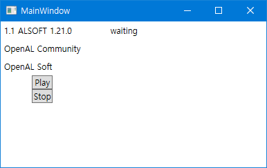

# OpenALExample-dotnet
Example code of OpenAL on dotnet core 3.1  

## Environment
- .NET Core 3.1 with WPF
- Windows 10 64bit 

## Feature
- Play multiple WAV files
- Stop currently playing files at once

## Details
I've mixed some example code from internet, basically from [Here](https://github.com/mono/opentk/blob/e5859900d3a41885e03be46b492bfd382442f130/Source/Examples/OpenAL/1.1/Playback.cs) and [Here](https://gist.github.com/kamiyaowl/32fb397e0141c65792e1). To test this on GUI environment, the WPF, this code only runs on Windows. However you can reuse the core code of this project in other operating system.

